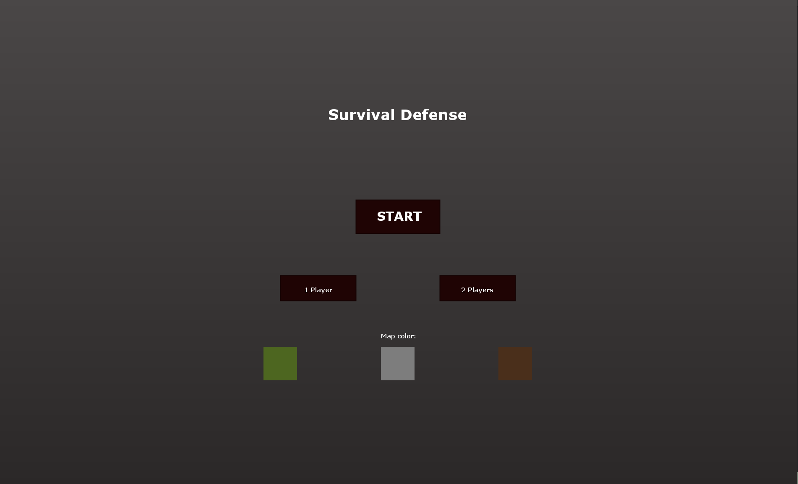
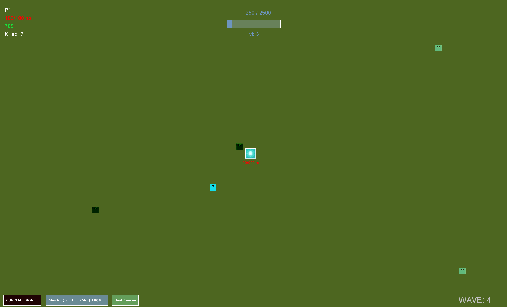
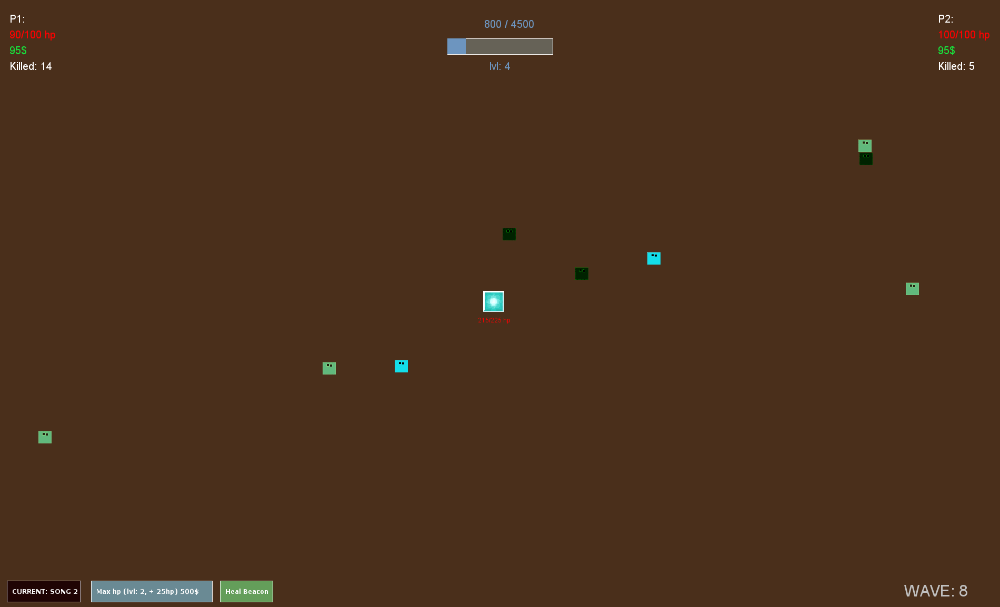
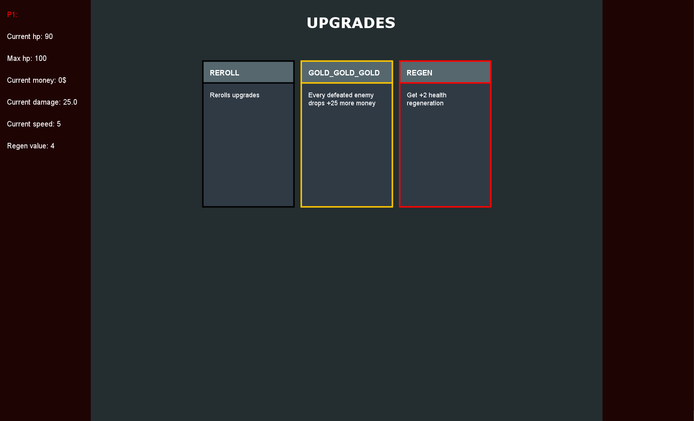

# 🛡️ Survival Defense

> **A fast-paced 2D base defense game built with Java Swing.**
> Defend the Beacon, level up, unlock powerful upgrades, and survive endless waves of enemies alone or with a friend.

---

## 🎮 Overview

**Survival Defense** is a 2D arcade survival game developed entirely in **Java** using the **Swing** framework.

The objective is simple: **protect the Beacon located in the center of the map**. As enemies become stronger and more numerous, players must defeat them, gain experience, level up, and choose powerful upgrades to stay alive.

The project was created to improve Java programming skills while applying **Object-Oriented Programming (OOP)** principles, game architecture and multimedia handling.

---

## ✨ Features

* 🎮 Singleplayer mode
* 👥 Local multiplayer (2 players on one keyboard)
* 🗺️ Multiple playable maps
* 💎 Defend the central Beacon
* ⚔️ Real-time melee combat
* 📈 Endless enemy waves with increasing difficulty
* ⭐ Experience and leveling system
* 🃏 Random upgrade cards after every level
* 💰 Gold economy and base upgrades
* 👹 Multiple enemy types, including bosses
* 🎵 Background music and sound effects
* 🎬 Cinematic intro with AI-generated voiceover

---

## 🃏 Upgrade System

Every time you level up, you are presented with **three random upgrade cards**.

Choose one to customize your build.

### 📊 Stat Upgrades

* 💥 Increased Damage
* ❤️ Maximum Health
* ⚡ Movement Speed
* 💰 More Gold
* 🛡️ Defense
* ⚔️ Attack Speed

### ✨ Special Upgrades

* 🧛 Vampire
* 🍀 Drunk Gambler
* 😡 Berserk
* ...and many more unique abilities.

Every playthrough can be completely different depending on your upgrade choices.

---

## 🌊 Enemy System

Enemies spawn continuously throughout the game.

As the game progresses:

* More enemies appear
* Stronger enemy variants begin spawning
* Boss encounters become more frequent
* The overall difficulty keeps increasing

Surviving longer requires both skill and smart upgrade decisions.

---

## 🎮 Controls

| Action | Player 1    | Player 2       |
| ------ | ----------- | -------------- |
| Move   | **W A S D** | **Arrow Keys** |
| Attack | **Space**   | **Enter**      |

---

## 🏗️ Technologies

* ☕ Java
* 🖥️ Java Swing
* 🎨 Custom graphics rendering
* 🔊 Audio integration
* 🎥 Video & intro playback
* 🤖 AI-generated voice intro
* 🎲 Randomized gameplay systems

---

## 🧠 Architecture (OOP Design)

This project focuses heavily on OOP concepts.

### ✔ Inheritance

Common functionality is shared through base classes.

### ✔ Polymorphism

Game entities override their own behavior while the engine processes them through common interfaces.

### ✔ Encapsulation

Object state is protected using private fields with controlled access through methods.

### ✔ Abstraction

The game engine works with generalized objects instead of implementation-specific classes.

### ✔ Enums

Enums are used to manage upgrades, enemy types, statistics, textures, and game constants.

---

## 📂 Project Structure

```text
src/
├── combat/
├── controls/
├── entities/
├── enums/
├── graphics/
├── images/
├── main/
├── sounds/
├── upgrades/
└── utils/
```

---

## 🚀 Getting Started

### Requirements

* Java 17 or newer
* All game assets placed inside the project's resources directory

### Run

Clone the repository:

```bash
git clone https://github.com/YourUsername/survival-defense.git
```

Open the project in your preferred IDE and run:

```text
src/main/Main.java
```

---

## 📸 Screenshots

<h2 align="center">🧭 Menu</h2>
<p align="center">
  
</p>
<p align="center">
  <b>Main menu where you can choose game mode (singleplayer / local co-op) and select a map before starting the game.</b>
</p>

<h2 align="center">🎮 Gameplay</h2>
<p align="center">
  
  
</p>
<p align="center">
  <b>Real-time gameplay where players defend the central Beacon against waves of enemies using melee combat and movement skills.</b>
</p>

<h2 align="center">🃏 Upgrades</h2>
<p align="center">
  
</p>
<p align="center">
  <b>Upgrade selection screen shown after leveling up. Players choose one of three random cards to improve stats or unlock special abilities.</b>
</p>

---

## 💡 Fun Facts

* 🎙️ Intro voice generated using AI.
* 🎵 Dynamic music changes depending on the game state.
* ⚡ Debounce system prevents accidental multiple interactions.
* 🎲 Every run feels different thanks to randomized upgrades.

---

## 📜 License

This project was developed for educational and experimental purposes.
